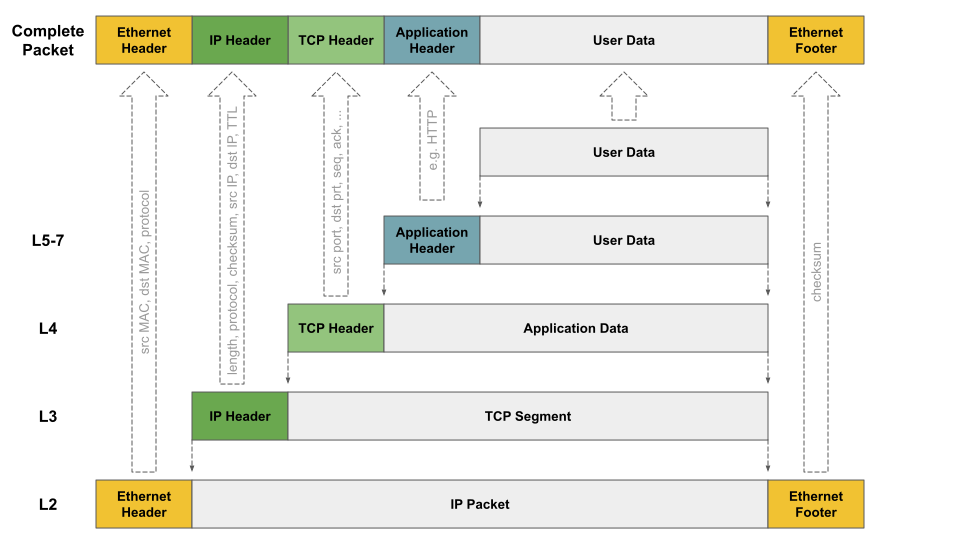

# 计算机网络

## 计算机网络分层

- 应用层（Application layer）
- 传输层（Transport layer）
- 网络层（Internet layer）
- 链路层（Link Layer）

## 常见问题

### MAC 地址的作用是负责同一内网的通信？

是的。

例如: 主机 A 通过 IP 地址访问主机 B

1、首先，主机 A 要获取主机 B 的 Mac 地址（如果系统的 ARP 表没有记录的话）。要通过 ARP 请求，获取到目标设备的 MAC 地址。

2、主机 A 创建以太网帧（Ethernet frame）设置 MAC 目标地址、MAC 源地址

3、通过交换机发向 主机 B

> Ethernet frame. In computer networking, an Ethernet frame is a data link layer protocol data unit and uses the underlying Ethernet physical layer transport mechanisms. 

### 交换机只会根据数据包的 MAC 地址把数据包送到目的位置，而不会去观察 IP 地址？

是的。

### 为什么在三次握手的时候 SYN 和 ACK 能够同时发送而四次挥手的时候，ACK + FIN 分开发送

三次握手中的SYN和ACK同时发送的情况与四次挥手中的ACK和FIN分开发送的场景是由不同的上下文和目的驱动的。

在TCP的三次握手中：

1. **初次连接**：客户端发送SYN表示它希望建立一个新的连接。此时它还不知道服务端是否准备好接受新的连接或是否能够响应。

2. **确认与建立连接**：当服务端收到SYN后，它需要确认这个SYN，同时也希望建立连接。因此，它同时发送ACK（来确认客户端的SYN）和自己的SYN。将它们一起发送是为了效率，因为这表示“我已确认你的连接请求，并且我也同意并希望建立连接”。

3. **节省时间和带宽**：同时发送SYN和ACK可以减少需要的消息数量，从而加快连接的建立速度并节省带宽。

在TCP的四次挥手中：

1. **数据传输可能仍在进行**：当一个方向上的连接被关闭，另一方可能仍然发送数据。所以，当接收到FIN时，对方首先确认这个FIN（通过发送ACK），然后在稍后的时间发送自己的FIN。

2. **两个方向的连接是独立的**：即使一个方向上的连接被关闭，另一个方向上的连接仍然可以保持打开状态。

总的来说，三次握手中的SYN和ACK可以同时发送，是因为它们都是连接建立过程中的积极响应。但在四次挥手的上下文中，分开发送ACK和FIN提供了更多的灵活性和可靠性，以确保连接在任何方向上都可以正确地关闭。
